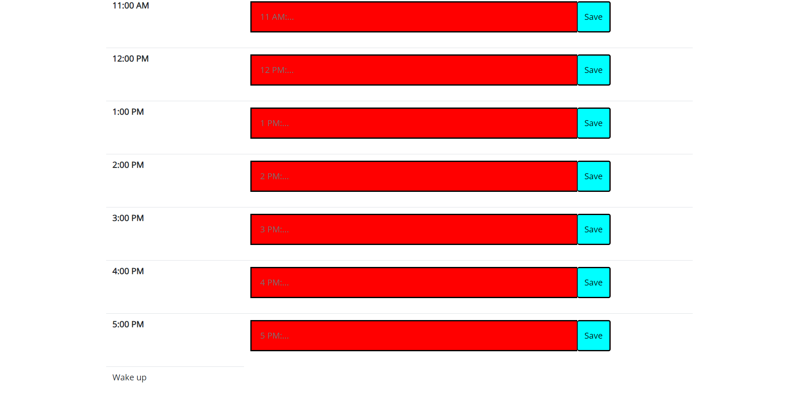
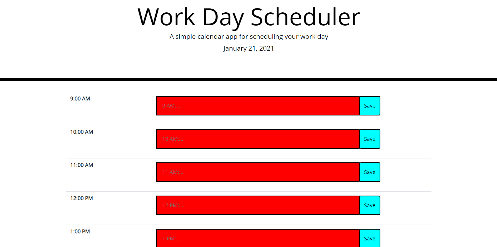

Work-Day-Scheduler

# Description

The Work Day Scheduler helps the user keep track of tasks they have. To use, the user enters the tasks into the specific time slot and saves it.

# Technologies Used

HTML5, CSS3, Bootstrap3, JavaScript, jQuery, local storage

# Screenshots

## Before Saving

## After Saving and Refresh

# Links

## Webpage URL

https://bryan-thaoxaochay.github.io/HW-5-Work-Day-Scheduler/ 

## Github Repo

https://github.com/Bryan-Thaoxaochay/HW-5-Work-Day-Scheduler 

# What I Learned

## HTML

With bootstrap, I learned how to create a table and the rows. It helped with organizing the time-blocks. Other than that, I got more practice with creating input elements, buttons, and changing it's size through adding inside the tag.

## CSS

I got to practice more with CSS by editing the input box and buttons.

## JS

One big thing I learned with JS in this project was learning how to use the date() extension and all its variations. For instance, how to get the date, month, year, and hour of the day. Along with that, I got some practice with local storage and how to use it. Then I also had to append what was in local storage onto the table, so practicing appending new elements to the table was very helpful. Lastly, figuring out how to change the color of the boxes was satisfying since it worked out pretty smooth. However, there is a lot of DRY code so hopefully I can try and figure out a more efficient way. Also, I got a lot of help from Nate with using "this" and connecting the onclick action with the button and the value of the textbox.

# Contact Info

Email: bthaoxaochay@gmail.com 
GitHub: https://github.com/Bryan-Thaoxaochay
